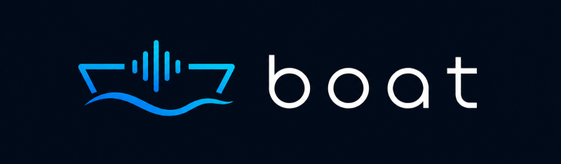

<div align="center">
  


[](https://pub.dev/packages/boat)
[](https://opensource.org/licenses/Apache-2.0)
[](https://flutter.dev)

</div>

**Production-grade realtime voice and audio engine for Flutter** — clean, echo-free bidirectional audio for AI voice conversations.

> **Status:** v1.0.0-preview.1. The public API is stable for review. Platform channel protocol may receive additive changes before the stable release.

---

## Table of Contents

- [The Problem](#the-problem)
- [Features](#features)
- [Quick Start](#quick-start)
- [Configuration](#configuration)
- [Audio Routing](#audio-routing)
- [Events](#events)
- [Diagnostics](#diagnostics)
- [API Reference](#api-reference)
- [Architecture](#architecture)
- [Platform Requirements](#platform-requirements)
- [Design Philosophy](#design-philosophy)
- [Rejected Approaches](#rejected-approaches)
- [Repository Structure](#repository-structure)
- [Development](#development)
- [Lineage](#lineage)
- [Contributing](#contributing)
- [License](#license)
- [Also by Circuids](#also-by-circuids)
- [Support](#support)

---

## The Problem

In **speaker mode**, the loudspeaker and exposed microphone create significant acoustic coupling. Without proper echo cancellation, the AI hears its own voice and interrupts itself. Headphones and earpieces avoid this through physical isolation — speaker mode does not.

Boat exists to solve speaker mode. It leverages the OS audio stack where true far-end reference signals are available:

| Audio Mode | Echo Risk | AEC Required |
|------------|-----------|--------------|
| Wired headphones | None | No |
| Wireless earbuds | Minimal | No |
| Earpiece | Low | Minimal |
| **Speakerphone** | **HIGH** | **CRITICAL** |

> AEC is handled entirely at the OS audio stack level — not in Flutter, not on the server.

Boat uses Android's native `AudioRecord`, `AudioTrack`, and `AudioEffects` APIs, and iOS's `AVAudioEngine` with `voiceChat` mode, to ensure echo cancellation works correctly across devices.

---

## Features

- **OS-Level AEC** — Acoustic echo cancellation via Android AudioEffects and iOS voiceChat mode
- **AGC and Noise Suppression** — Automatic gain control and environmental noise reduction
- **Unified Engine** — Single `BoatEngine` for capture and playback, no split classes
- **Hot Reconfiguration** — Change sample rate, effects, or route without full restart
- **Audio Routing** — Speaker, earpiece, Bluetooth, wired headset, USB
- **Stream-Native** — Audio frames and state changes flow as typed Dart streams
- **Typed Events** — Sealed `BoatEvent` hierarchy for state, route, effect, and error observation
- **Diagnostics** — Device info, per-effect status, frame counters, session uptime
- **Typed Exceptions** — `BoatConfigException`, `BoatPermissionException`, `BoatNativeException`, `BoatStateException`
- **Zero External Dependencies** — Only `plugin_platform_interface` beyond Flutter SDK
- **Dual-Platform** — Android (API 26+) and iOS (13.0+) from v1.0

---

## Quick Start

### 1. Add to pubspec.yaml

```yaml
dependencies:
  boat: 1.0.0-preview.1
```

### 2. Platform Setup

**Android** — add to `android/app/src/main/AndroidManifest.xml`:

```xml
<uses-permission android:name="android.permission.RECORD_AUDIO" />
<uses-permission android:name="android.permission.MODIFY_AUDIO_SETTINGS" />
<uses-permission android:name="android.permission.BLUETOOTH" />
<uses-permission android:name="android.permission.BLUETOOTH_CONNECT" />
```

> `BLUETOOTH_CONNECT` requires runtime permission on Android 12+ (API 31+).

**iOS** — add to `ios/Runner/Info.plist`:

```xml
<key>NSMicrophoneUsageDescription</key>
<string>This app needs microphone access for voice conversations.</string>
```

### 3. Request Permission and Start

```dart
import 'package:boat/boat.dart';

// Request microphone permission before starting
final status = await BoatPermission.request(PermissionType.microphone);
if (status != PermissionStatus.granted) return;

final engine = BoatEngine();
await engine.start();
```

### 4. Capture and Play Audio

```dart
// Listen for captured microphone audio
engine.captureFrames.listen((frame) {
  // Clean PCM audio — send to your backend
  sendToBackend(frame.pcm);
});

// Play audio received from your backend
engine.playRaw(pcmFromBackend);
```

### 5. Observe State

```dart
engine.events.listen((event) {
  switch (event) {
    case BoatStateChanged(:final current):
      debugPrint('State: $current');
    case BoatWarning(:final code, :final message):
      debugPrint('Warning [$code]: $message');
    case BoatError(:final exception):
      debugPrint('Error: ${exception.message}');
    case BoatRouteChanged(:final current):
      debugPrint('Route: $current');
    case BoatEffectStatusChanged(:final effect, :final active):
      debugPrint('$effect active: $active');
  }
});
```

### 6. Clean Up

```dart
await engine.stop();
await engine.dispose();
```

---

## Configuration

`BoatConfig` is immutable with sensible defaults for voice communication:

```dart
await engine.start(BoatConfig(
  sampleRate: 16000,          // Hz
  channelCount: 1,            // mono
  bitsPerSample: 16,          // 16-bit PCM (only supported format in v1)
  bufferDurationMs: 20,       // 5-100 ms
  aec: true,                  // acoustic echo cancellation
  agc: true,                  // automatic gain control
  noiseSuppression: true,     // environmental noise reduction
  speakerMode: true,          // speaker vs earpiece fallback
  preferredRoute: AudioRoute.speaker,
));
```

**Fluent builder:**

```dart
final config = BoatConfig.builder()
    .sampleRate(48000)
    .noiseSuppression(false)
    .preferredRoute(AudioRoute.bluetooth)
    .build();

await engine.start(config);
```

**Hot reconfiguration** — change settings without creating a new engine:

```dart
await engine.reconfigure(BoatConfig(sampleRate: 48000));
```

---

## Audio Routing

Boat supports five output routes:

| Route | Description |
|-------|-------------|
| `AudioRoute.speaker` | Loudspeaker — primary design target |
| `AudioRoute.earpiece` | Ear speaker (phone-to-ear) |
| `AudioRoute.bluetooth` | Bluetooth SCO/A2DP |
| `AudioRoute.wiredHeadset` | Wired headphones or headset |
| `AudioRoute.usb` | USB audio device |

```dart
// Query current route
final route = engine.currentRoute;

// Change route explicitly
await engine.setRoute(AudioRoute.earpiece);
```

**Routing priority:** External devices (Bluetooth, wired, USB) always take priority over `speakerMode` and `preferredRoute`. Those settings only affect the fallback when no external device is connected. Device connect/disconnect events re-apply routing automatically.

---

## Events

All events extend `BoatEvent` and carry a `timestamp`:

| Event | Emitted When |
|-------|-------------|
| `BoatStateChanged` | Engine transitions between lifecycle states |
| `BoatRouteChanged` | Active audio output route changes |
| `BoatEffectStatusChanged` | An audio effect's availability or active state changes |
| `BoatWarning` | Non-fatal issue from the native audio layer |
| `BoatError` | Fatal error — engine moves to `BoatState.error` |

**Lifecycle states:**

```
idle → starting → running → stopping → idle
                    ↕
                  paused
                    ↓
                  error
                    ↓
                 disposed (terminal)
```

---

## Diagnostics

```dart
final diag = await engine.diagnostics;

diag.deviceModel;          // e.g. "Pixel 7"
diag.osVersion;            // e.g. "Android 14"
diag.audioSessionId;       // native session identifier
diag.currentRoute;         // active AudioRoute
diag.availableRoutes;      // all currently available routes
diag.captureFrameCount;    // frames captured since start
diag.playbackFrameCount;   // frames played since start
diag.uptime;               // Duration since engine start
diag.scoDeviceConnected;   // true if Bluetooth SCO is active (8 kHz narrowband)
diag.effectStatus;         // Map<AudioEffectType, EffectStatus>
```

Each `EffectStatus` reports three booleans: `supported` (hardware capability), `available` (currently usable), and `active` (processing audio).

---

## API Reference

### BoatEngine

```dart
class BoatEngine {
  // Lifecycle
  Future<void> start([BoatConfig? config]);
  Future<void> stop();
  Future<void> pause();
  Future<void> resume();
  Future<void> dispose();         // terminal — cannot restart
  Future<void> reconfigure(BoatConfig config);

  // State
  BoatState get state;
  Stream<BoatEvent> get events;

  // Capture (microphone → consumer)
  Stream<AudioFrame> get captureFrames;

  // Playback (consumer → speaker)
  void play(AudioFrame frame);
  void playRaw(Uint8List pcm);
  Future<void> flushPlayback();

  // Routing
  AudioRoute get currentRoute;
  Future<void> setRoute(AudioRoute route);

  // Diagnostics
  Future<BoatDiagnostics> get diagnostics;
}
```

### AudioFrame

```dart
class AudioFrame {
  final Uint8List pcm;          // 16-bit signed little-endian
  final int sequenceNumber;     // monotonic since engine start
  final Duration timestamp;     // time since engine start
  final int sampleRate;         // Hz
  final int channelCount;       // channels

  int get byteLength;
  Duration get duration;
}
```

### BoatPermission

```dart
class BoatPermission {
  static Future<PermissionStatus> check(PermissionType type);
  static Future<PermissionStatus> request(PermissionType type);
  static Future<void> openSettings();
}
```

### Exception Hierarchy

```
BoatException
├── BoatConfigException      — invalid configuration
├── BoatPermissionException  — microphone permission denied
├── BoatNativeException      — native audio layer failure
└── BoatStateException       — invalid lifecycle transition
```

---

## Architecture

```
┌─────────────────────────────────────────────────────────┐
│                   FLUTTER APPLICATION                    │
├─────────────────────────────────────────────────────────┤
│                                                         │
│  ┌───────────────────────────────────────────────────┐  │
│  │              BoatEngine (Dart)                     │  │
│  │  Lifecycle / Config / Capture / Playback / State  │  │
│  └──────────────────────┬────────────────────────────┘  │
│                         │ Platform Interface             │
│                         ▼                               │
│  ┌───────────────────────────────────────────────────┐  │
│  │           MethodChannelBoat (Dart)                 │  │
│  │  Method channel: lifecycle, config, routing       │  │
│  │  Event channel: state events                      │  │
│  │  Event channel: capture PCM frames                │  │
│  └──────────────────────┬────────────────────────────┘  │
│                         │ Platform Channels             │
├─────────────────────────┼───────────────────────────────┤
│                         ▼                               │
│  ┌──────────────────┐      ┌────────────────────────┐  │
│  │ Android (Kotlin) │      │      iOS (Swift)       │  │
│  │                  │      │                        │  │
│  │ AudioRecord      │      │ AVAudioEngine          │  │
│  │ AudioTrack       │      │ AVAudioIONode (input)  │  │
│  │ AcousticEcho-    │      │ AVAudioPlayerNode      │  │
│  │   Canceler       │      │ voiceChat mode         │  │
│  │ AGC / NS         │      │ (implicit AEC/AGC/NS)  │  │
│  └──────────────────┘      └────────────────────────┘  │
└─────────────────────────────────────────────────────────┘
```

**Key design decisions:**

- The OS audio stack is the authority — no software DSP, no WebRTC
- Shared audio session between capture and playback for AEC correlation
- `VOICE_COMMUNICATION` source on Android (only source with AEC coupling)
- `AVAudioSession` voiceChat mode on iOS (implicit voice processing)

---

## Platform Requirements

| Platform | Minimum Version | Notes |
|----------|----------------|-------|
| Android | API 26 (8.0) | `AudioRecord.Builder` and `AudioFocusRequest.Builder` require API 26+ |
| iOS | 13.0 | `AVAudioEngine` + voiceChat mode. Privacy manifest bundled in pod. |

| Requirement | Version |
|-------------|---------|
| Dart SDK | >=3.9.2 |
| Flutter | >=3.3.0 |

**Device notes:**

- AEC quality varies by Android device manufacturer and hardware DSP. Check `BoatDiagnostics.effectStatus` for per-effect availability.
- Emulators and simulators do not support AEC or audio capture. Test on physical devices.
- Bluetooth SCO connections couple capture to 8 kHz narrowband — expect degraded quality.

---

## Design Philosophy

1. **OS audio stack is the authority** — no software DSP, no WebRTC, no server-side processing
2. **Minimal API surface** — every method has a single, clear purpose
3. **Explicit over implicit** — configuration is declared, never inferred
4. **Stream-native** — audio data and state changes flow as typed Dart streams
5. **Platform-honest** — the API reflects platform audio capabilities without abstraction leakage
6. **Fail-fast** — typed exceptions and state guards prevent silent misbehavior

---

## Rejected Approaches

Boat's architecture is the result of extensive experimentation. The following approaches were tried, measured, and explicitly rejected:

| Approach | Why It Failed |
|----------|---------------|
| WebRTC client-side audio loop | No sample-accurate reference injection; clock drift between capture and playback stacks destroys AEC correlation |
| Manual echo reference feeding | Dart VM and platform channel latency make sub-millisecond alignment impossible; software AEC is inferior to hardware DSP |
| Flutter-level DSP (pure Dart / FFI) | GC pauses and channel overhead add unacceptable latency; no access to true analog reference signal; high CPU and battery cost |
| `permission_handler` package | 4+ transitive dependencies for 2 permission types; violates zero-dependency philosophy |
| Auto-request permissions in `start()` | Couples OS dialog timing to engine lifecycle; violates explicit-over-implicit design |
| Separate playback class | Standalone playback bypasses the engine's audio session and breaks AEC correlation |
| Custom playback queue with silence-writing | OS built-in buffers (`setBufferSizeInFrames`, `WRITE_BLOCKING`) handle queuing and underrun natively |
| Event bus / async pipeline stages | Audio frames are inherently ordered; async communication breaks ordering guarantees and adds scheduling jitter |

The consistent lesson: **the OS audio stack is the only layer where capture and playback share the timing context required for reliable echo cancellation.** Boat configures and observes that stack — it does not replace it.

---

## Repository Structure

```
boat/
├── src/                    # Plugin package (published to pub.dev)
│   ├── lib/                # Dart source
│   │   ├── boat.dart       # Public barrel export
│   │   └── src/            # Implementation
│   ├── android/            # Kotlin native implementation
│   ├── ios/                # Swift native implementation
│   ├── example/            # Example app
│   └── test/               # Unit tests
├── test_app/               # Diagnostics and integration test app
└── docs/                   # Public documentation
```

---

## Development

### Prerequisites

- Flutter >=3.3.0 with Android and iOS toolchains
- Physical Android device (API 26+) and iOS device (13.0+) — emulators do not support AEC

### Running Tests

```bash
cd src
flutter test
```

### Running the Example

```bash
cd src/example
flutter run
```

### Running the Diagnostics App

```bash
cd test_app
flutter run
```

---

## Lineage

Boat is the production evolution of the `voice_core` prototype. All architectural learnings, rejected approaches, and AEC insights from voice_core are carried forward into Boat's foundation.

---

## Contributing

Contributions are welcome. Please open an issue before any change that touches public API or adds a dependency.

1. Fork the repository
2. Create a feature branch
3. Add tests for new behavior
4. Ensure `flutter test` passes in `src/`
5. Submit a pull request

---

## License

Apache License 2.0. Copyright (c) 2026 Circuids. See [LICENSE](src/LICENSE) for details.

The Boat name and logo are trademarks of Circuids and are not covered by the Apache License. See [TRADEMARKS.md](src/TRADEMARKS.md) for the trademark policy.

---

## Also by Circuids

| Package | Description |
|---------|-------------|
| [**Fairy**](https://github.com/Circuids/Fairy) | Lightweight MVVM framework for Flutter with typed reactive data binding, commands, and DI — no code generation. |
| [**Levee**](https://github.com/Circuids/Levee) | Dependency-free pagination engine with cache-first architecture and generic page key support. |

---

## Support

- **Issues**: [GitHub Issues](https://github.com/Circuids/boat/issues)
- **Discussions**: [GitHub Discussions](https://github.com/Circuids/boat/discussions)

